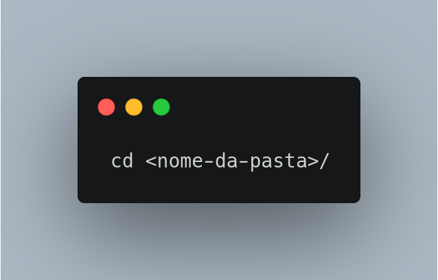
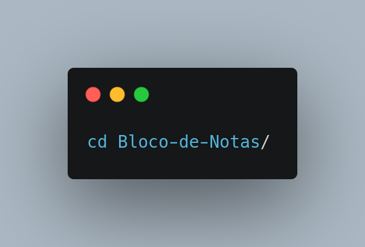
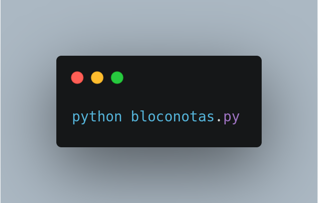
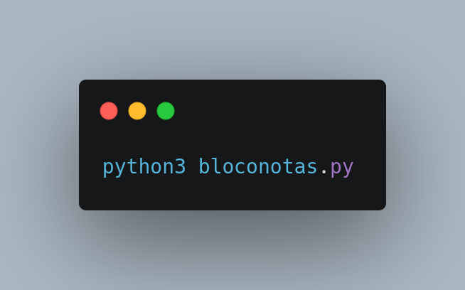
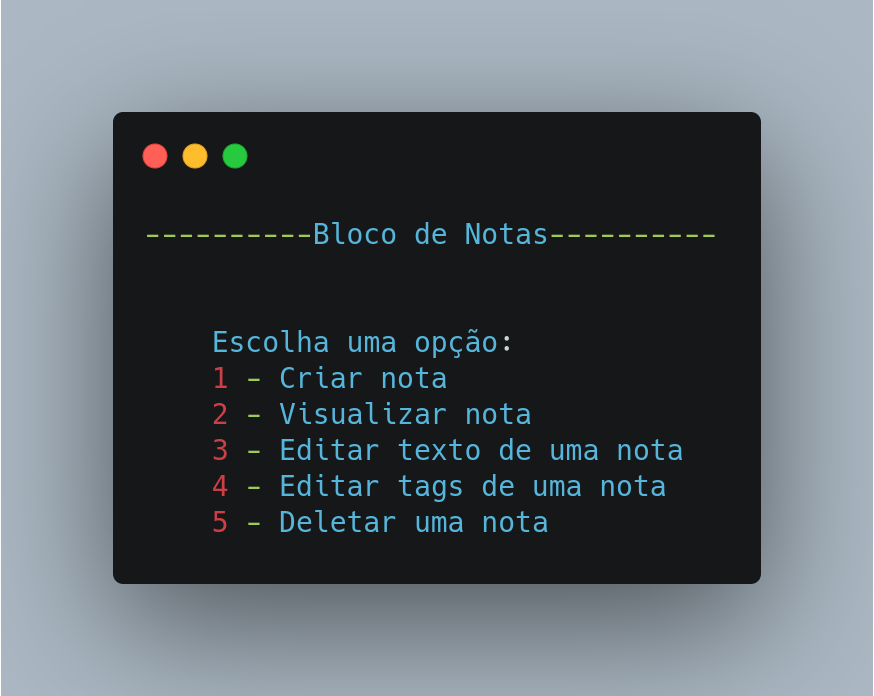

# Bloco de Notas em Python

## Resumo

Vamos construir uma aplicação simples de comando de linha de um bloco de notas. O problema consiste em: notas curtas são armazenadas nesse bloco de notas, cada nota deve gravar o dia que foi escrita e podem ser adicionadas tags para facilitar as consultas. Deve ser possível também modificar e procurar as notas. É demonstrado abaixo o diagrama de classes simples para esse problema.

## Como rodar o código

Este código foi subdivido em duas partes, no arquivo “main.py” estão armazenadas todas as funções criadas para gerar cada parâmetro do programa, e no arquivo “bloconotas.py” estão onde ocorre as chamadas das funções utilizadas para gerar o bloco de notas pedido na questão. Primeiramente os arquivos estão zipados, dentro da pasta “Bloco-de-Notas”e precisarão ser descomprimidos, em seguida eles se encontrarão no diretório “/Bloco-de-Notas”, para rodar o programa, é necessário obter python3 instalado na máquina, em seguida abra a pasta em um terminal, clicando na pasta com botão direito do mouse aparecerá a opção “abrir no terminal” ou você pode abrir a pasta  utilizando o comando:

se a pasta “Bloco-de-Notas” estiver dentro do seu diretório home use:

em seguida, para rodar o código use:

                  ou 

dependendo do comando padrão para rodar o python3 na sua máquina o comando pode mudar. Quando bloconotas.py for executado irá aprecer um menu com opções a serem escolhidas:

Escolha 1, se quiser criar uma nota, ele irá pedir que você digite o texto, e em seguida pedirá para você adicionar uma tag para a nota, a tag deve ser algo como: ex: tag1, frase, com espaço depois da vírgula. Mas se não quiser adicionar nenhuma tag, o programa criará a nota da mesma forma.

Escolha 2, se quiser visualizar as notas já criadas, ele pedirá para que você insira a tag da nota desejada, ex: “tag1, frase”. Mas se não quiser procurar por tag e deseja visualizar todas as notas, basta clicar ‘enter’ e ele mostrará todas as notas criadas.

ex: tag1 -> (‘1’, ‘texto teste’, ‘06-04-21’, ‘tag1, frase’)

Escolha 3, para editar o texto da nota desejada, ao escolher esta opção, ele irá perguntar o id da nota, as notas são compostas por (‘id’, ‘texto da nota’, ‘data’, ‘tag’), ao gerar uma nota ela será armazenada em um banco de dados “bloconotas.db” que será organizado por Id’s de 1 em diante, então basta digitar o id para ele listar no banco, em seguida ele pedirá para digitar o novo texto, para ver a nota modificada, basta utilizar o comando “python3 bloconotas.py” novamente, este comando tem que ser utilizado todas vez que você quiser utilizar outras opções.

ex: id 1 -> (‘1’, ‘texto teste’, ‘06-04-21’, ‘tag1, frase’)

Escolha 4, se deseja editar a tag de alguma nota, ao executar esta opção  ele pedirá o id da nota, em seguida pedirá para digitar a nova tag da nota. Com o formato explicado mais acima -> tag1, frase.

Escolha 5, se deseja excluir alguma nota, ao executar esta opção ele irá perguntar o id da nota que você deseja deletar, para ter certeza de qual nota deseja deletar basta rodar novamente o programa e escolher a opção 2 para visualizar todas as notas.